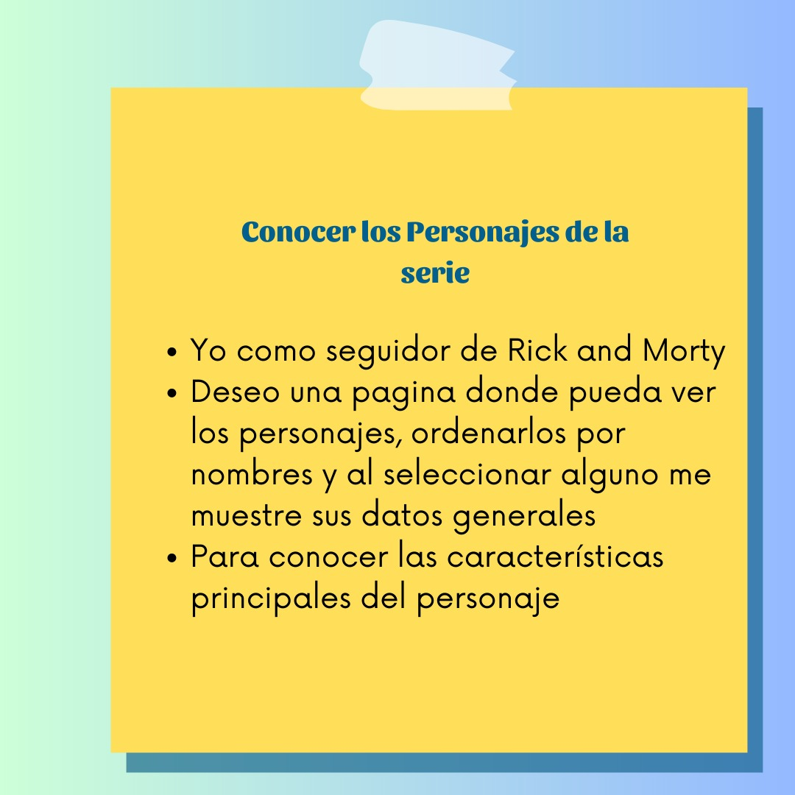
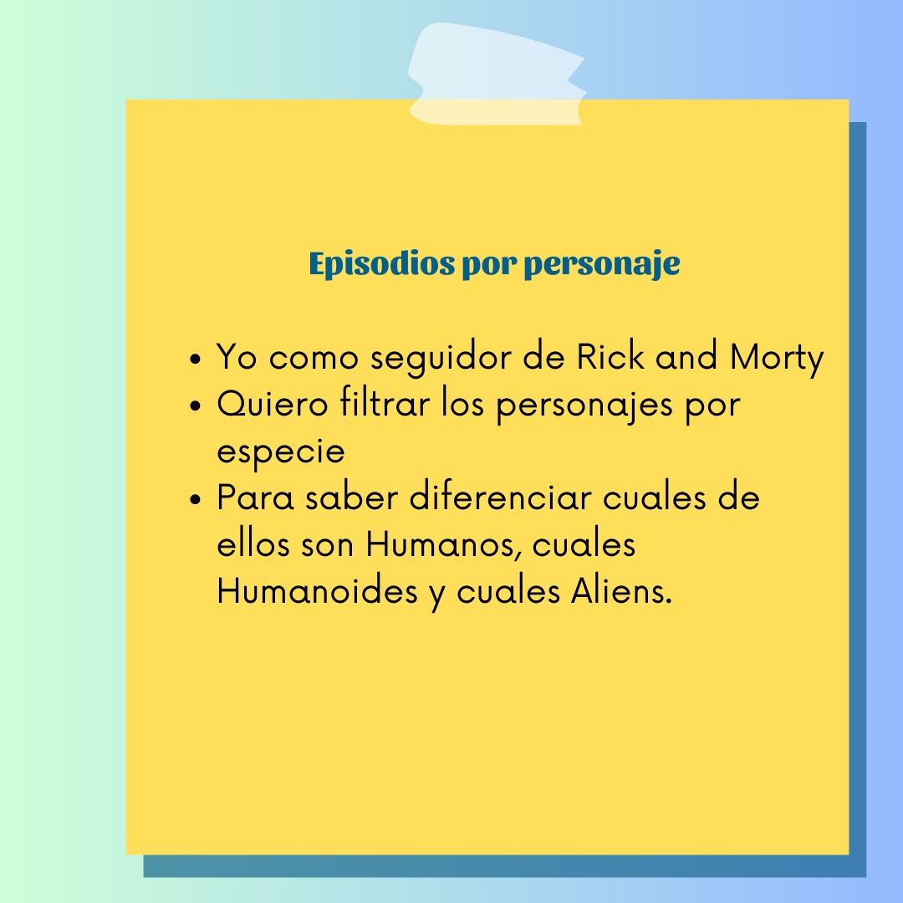
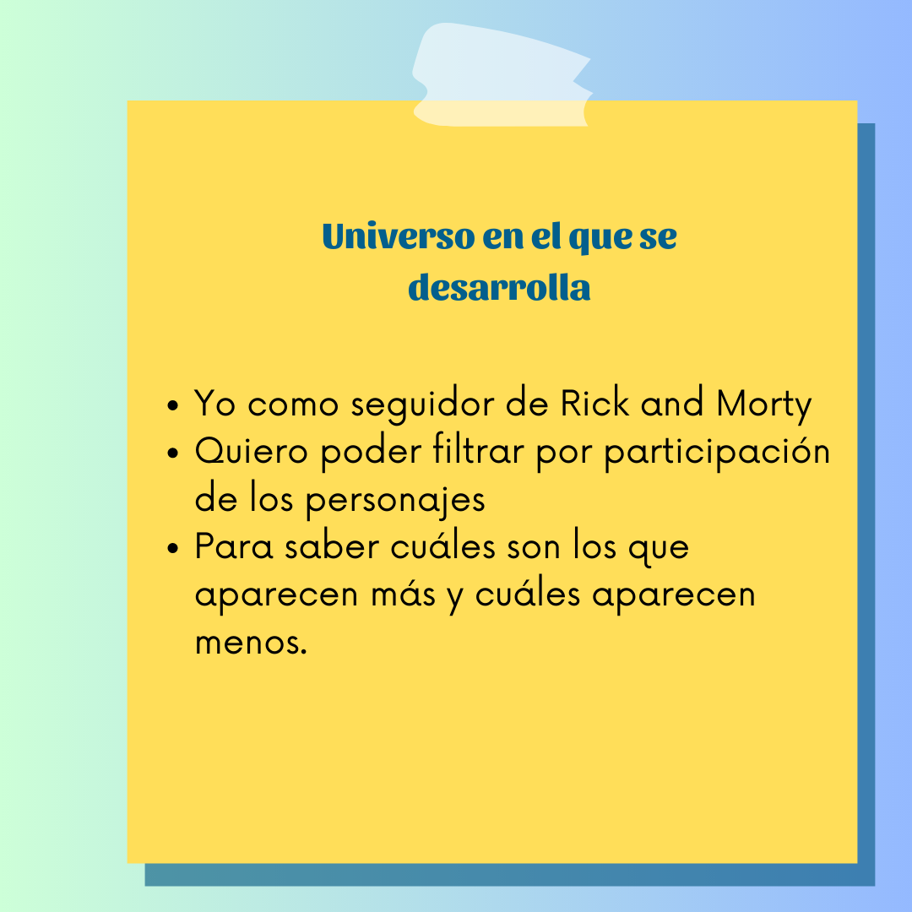
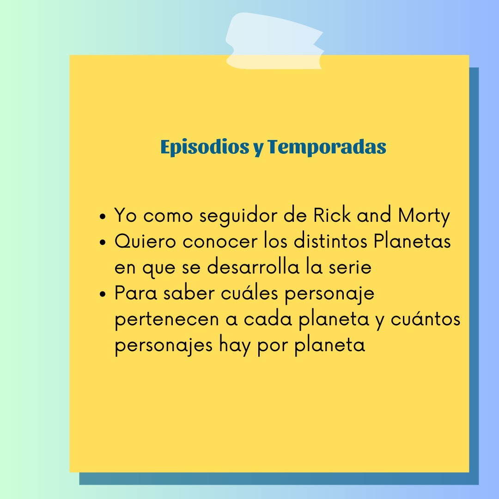
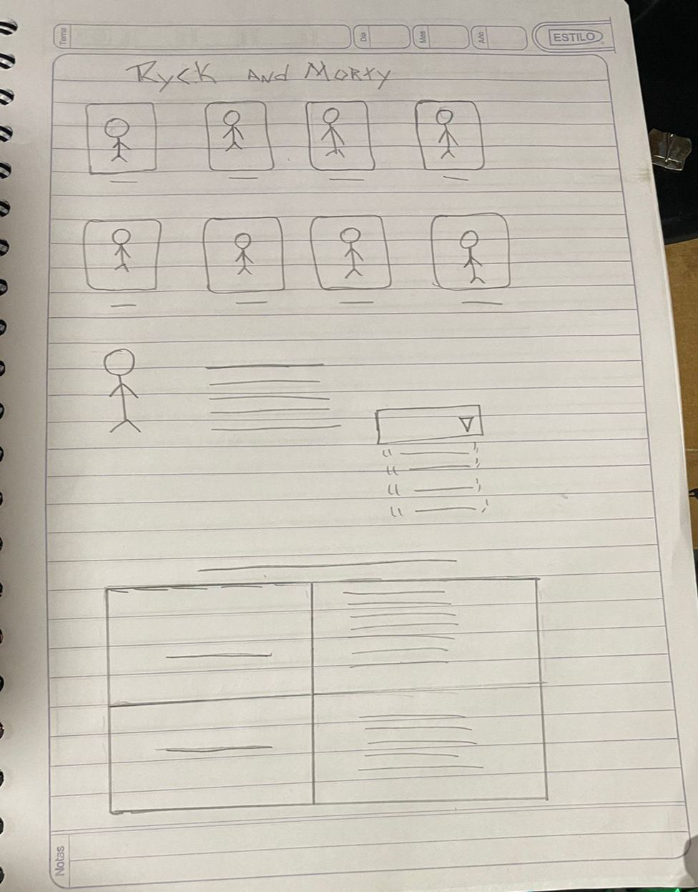
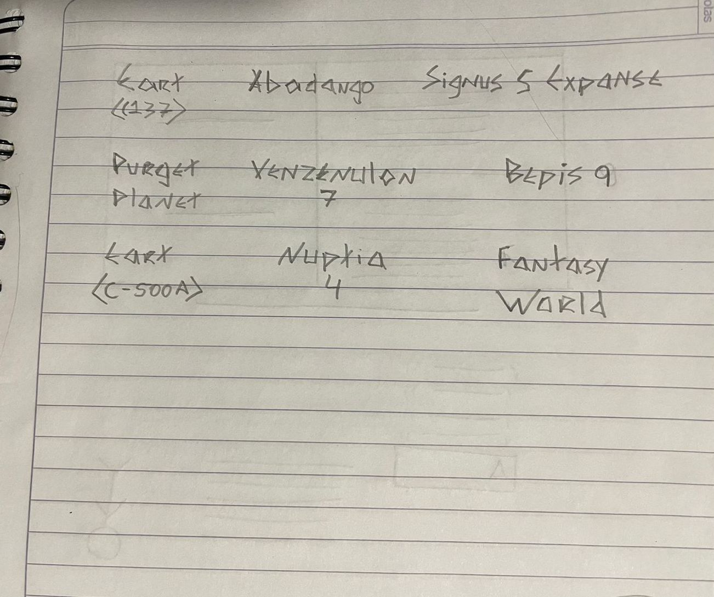
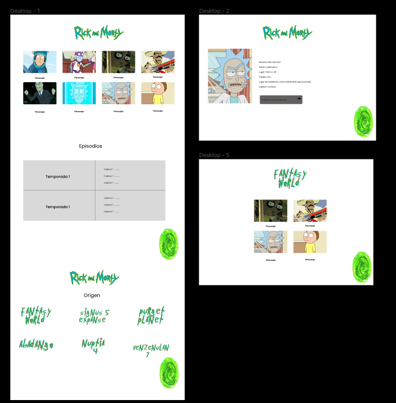

# Data Lovers

## Índice

* [1. Preámbulo](#1-preámbulo)
* [2. Usuarios Principales del Producto](#2-resumen-del-proyecto)
* [3. Objetivos de los Usuarios](#3-objetivos-de-aprendizaje)
* [4. Consideraciones generales](#4-consideraciones-generales)
* [5. Criterios de aceptación mínimos del proyecto](#5-criterios-de-aceptación-mínimos-del-proyecto)
* [6. Hacker edition](#6-hacker-edition)
* [7. Consideraciones técnicas](#7-consideraciones-técnicas)
* [8. Pistas, tips y lecturas complementarias](#8-pistas-tips-y-lecturas-complementarias)
* [9. Checklist para solicitar PF](#9-checklist-para-solicitar-pf)

***

## 1. Preámbulo

Este proyecto consiste en la creación de una página interactiva para los seguidores de la serie "Rick and Morty". El objetivo principal es proporcionar una experiencia diferente y divertida para los fans, mostrando de manera interactiva la información de los personajes de la serie. La página incluye funcionalidades como filtrado por especie, ordenado alfabético, cálculo de personajes por planeta y estadísticas de participación en la serie.
Rick and Morty Fan Page.

## 2. Usuarios Principales del Producto

Los principales usuarios de este producto son:

* Seguidores de la serie "Rick and Morty".
* Personas interesadas en explorar la data de los personajes de la serie.
* Fans que deseen interactuar con una página dedicada a su serie favorita.

### 3. Historias de usuario
Se nos entrego una data basada en una rapida investigacion sobre la series de Rick and Morty, sobre la informacion que posrian necesitar los usuarios y basadas en esta data construimos las siguientes Historias de usuario con sus respectivos criterios de aceptacion y definiciones de terminado:

   

#### 4. Objetivos de los Usuarios

Los usuarios de esta página tienen los siguientes objetivos en relación con el producto:
* Conocer los personajes de la serie.
* Explorar y obtener información detallada de los personajes de la serie "Rick and Morty".
* Filtrar personajes por especie para conocer más sobre cada grupo.
* Ordenar los personajes alfabéticamente para una búsqueda más fácil.
* Visualizar la cantidad de personajes que habitan en cada planeta.
* Identificar los personajes que participan más y menos en la serie, basado en la cantidad de capítulos en los que participan.

##### 5. Solución Proporcionada por el Producto

El producto que hemos desarrollado satisface las necesidades de los usuarios de la siguiente manera:
* Proporciona una interfaz interactiva y atractiva para explorar la data de los personajes.
* Permite filtrar los personajes por especie, lo que facilita la búsqueda de información     
  específica.
* Ofrece la opción de ordenar los personajes alfabéticamente, mejorando la experiencia de búsqueda.
* Calcula automáticamente la cantidad de personajes que habitan en cada planeta, brindando una  
  visión general.
* Muestra estadísticas de participación en la serie, ayudando a identificar los personajes más y  
  menos recurrentes.
* Presenta un gráfico de barras que muestra la cantidad de personajes que viven en cada planeta.

Con esta solución, esperamos brindar a los seguidores de "Rick and Morty" una experiencia interactiva al explorar la data de la serie, así como proporcionar herramientas útiles para filtrar, ordenar y analizar la información de los personajes y episodios.

###### 6. Decisiones de Diseño

Para elaborar la pagina de este proyecto comenzamos diseñando un prototipo de baja fidelidad que es el siguiente:  

     

Basado en este diseño realizamos el prototipo de alta fidelidad:

Ya listo se le hizo con figma el modo dinamico para el test de usabilidad, el cual puede verse en el siguiente link: [Prototipo en Figma dinamico](https://www.figma.com/proto/dD9cmpLmQd1FVa1Ny9CMll/Untitled?page-id=0%3A1&node-id=1-2&starting-point-node-id=1%3A2&mode=design&t=GuOBoWdgBB15zKWa-1)

Listado de problemas que se detectaro con el test de usabilidad:

* Recibimos de comentario que agregaramos una flecha de regreso al portal5, para hacer mas obvia   
  su funcion.
* Darle un menu debajo del logo para ordenar mejor los select de filtrado y ordenado.
* El fondo no llamaba la atencion. 

##### 7. Descripcion de la funcionalidad

La página principal muestra tarjetas interactivas de los personajes de "Rick and Morty". Al hacer clic en una tarjeta, te lleva a una ventana oculta que muestra la información detallada sobre el personaje, como su nombre, género, especie, entre otros datos relevantes.

Además, se muestran tarjetas giratorias con los nombres de los planetas, al pasar el cursor sobre estas tarjetas, se voltean y muestran una lista de los personajes que habitan en cada planeta.

Se han utilizado elementos visuales y colores relacionados con la serie.

Por ultimo se presenta una grafica donde al pasar el cursor por las barras se muestra la cantidad de personajes que habitanen cada uno de los planetas.

#### 8. Herramientas Utilizadas

Para desarrollar este proyecto se utilizaron las siguientes herramientas:

HTML: Para estructurar el contenido de la página web, se creo una interfaz de usuario simple y fácil de usar.

CSS: Para aplicar estilos y diseñar la interfaz de usuario.

JavaScript: Para agregar funcionalidad: 
*  Manejo de eventos del DOM para mostrar imagenes y datos.
* Select que permite ordenar data por uno o más campos (asc y desc).
* Filter que permite filtrar data en base a una condición.
* Calculo agregado para cantidad de personaes por planeta y frecuencia de participación en la   
  serie.

Canva: para diseñar imágenes y paleta de colores, la cual se seleccionó para proporcionar una apariencia atractiva y legible en la página web. 

Figma: Se ocupó esta herramienta para diseñar el Prototipo de alta fidelidad, y diseño dinamico para el test de usabilidad.
